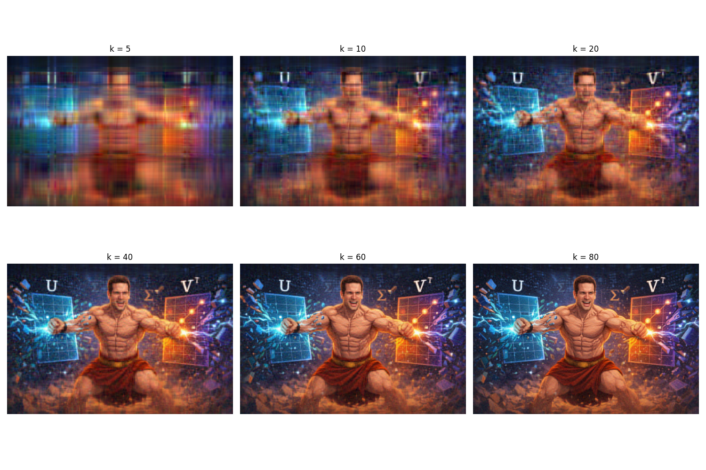

# Image Compression & Classification Analysis

This project explores fundamental algorithmic methods in data science, focusing on dimensionality reduction and classification techniques applied to image data. It demonstrates the practical application of Singular Value Decomposition (SVD) for image compression and Principal Component Analysis (PCA) combined with K-Nearest Neighbors (KNN) for efficient image classification.

## Project Overview

### 1. Image Compression using SVD (`Q7.py`)
This script implements image compression by applying Singular Value Decomposition (SVD) to the RGB channels of an image. By retaining only the top-$k$ singular values, we can reconstruct the image with significantly less data while preserving visual fidelity.

**Key Features:**
- Decomposes images into Red, Green, and Blue matrices.
- Performs SVD on each channel independently.
- Reconstructs the image using varying ranks ($k = 5, 10, \dots, 80$).
- quantifies compression loss using the relative Frobenius norm error.

**Visual Results:**

*Figure 1: Reconstruction of the original image at different compression levels (k).*

*(See also `Q7_errors.jpeg` for a visualization of the reconstruction error)*

### 2. CIFAR-10 Classification with PCA & KNN (`Q8.py`)
This script analyzes the trade-off between dimensionality reduction and classification accuracy on the CIFAR-10 dataset. It combines PCA for feature extraction with a vectorized KNN implementation for classification.

**Key Features:**
- **Preprocessing:** Converts CIFAR-10 images to grayscale.
- **Dimensionality Reduction:** Implements PCA from scratch (using SVD) to project images into a lower-dimensional subspace ($s$ components).
- **Classification:** Uses a highly optimized, vectorized K-Nearest Neighbors algorithm to classify images.
- **Analysis:** Evaluates performance across different numbers of principal components ($s$) and neighbors ($k$).

*(See `Q8_Errors.jpeg` for performance analysis charts)*

## File Structure

- **`Q7.py`**: Source code for SVD image compression.
- **`Q8.py`**: Source code for PCA + KNN classification on CIFAR-10.
- **`DanGarber.jpeg`**: Input image for the compression demo.
- **`cifar-10-batches-py/`**: Directory containing the CIFAR-10 dataset.

## Usage

To run the image compression demo:
```bash
python Q7.py
```

To run the classification analysis (ensure CIFAR-10 dataset is present):
```bash
python Q8.py
```
